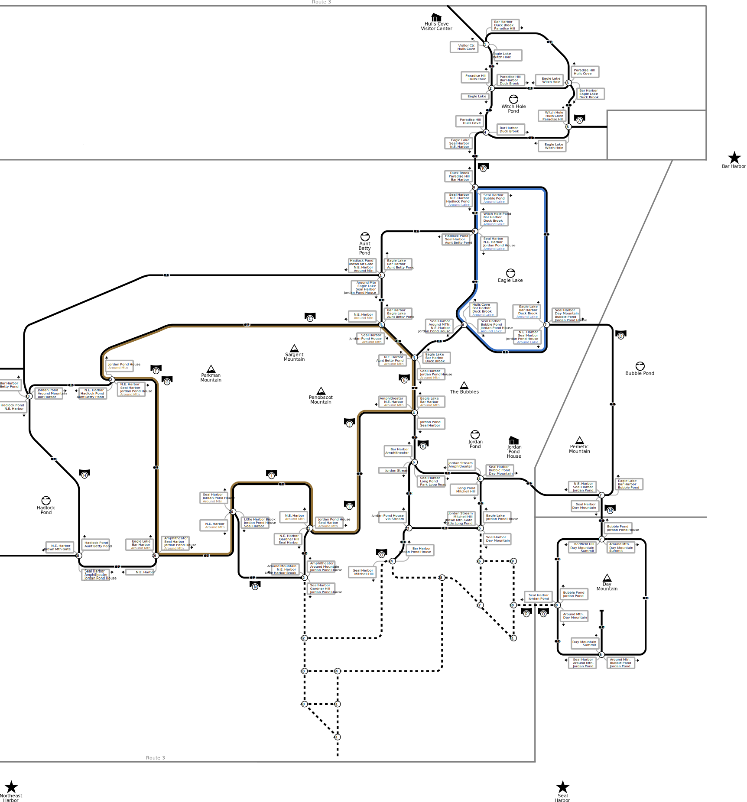

# acadia-carriage-roads-map

A map that displays information about the carriage roads in Acadia National
Park. The maps have been designed with the following in mind:

- Understanding of carriage road intersection numbers and where they go, trying
  to navigate based on just the signs at intersections is notoriously difficult.
- Minimize the distractions that are caused by maps with roads that are
  overlayed on a geographically accurate depiction where roads have turns and
  switchbacks and important details may be obscured.
- Fits on a single sheet of letter paper.

The map files are licensed under a [Creative Commons Attribution-ShareAlike 4.0 International License](http://creativecommons.org/licenses/by-sa/4.0/).

